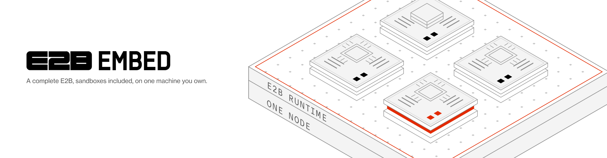
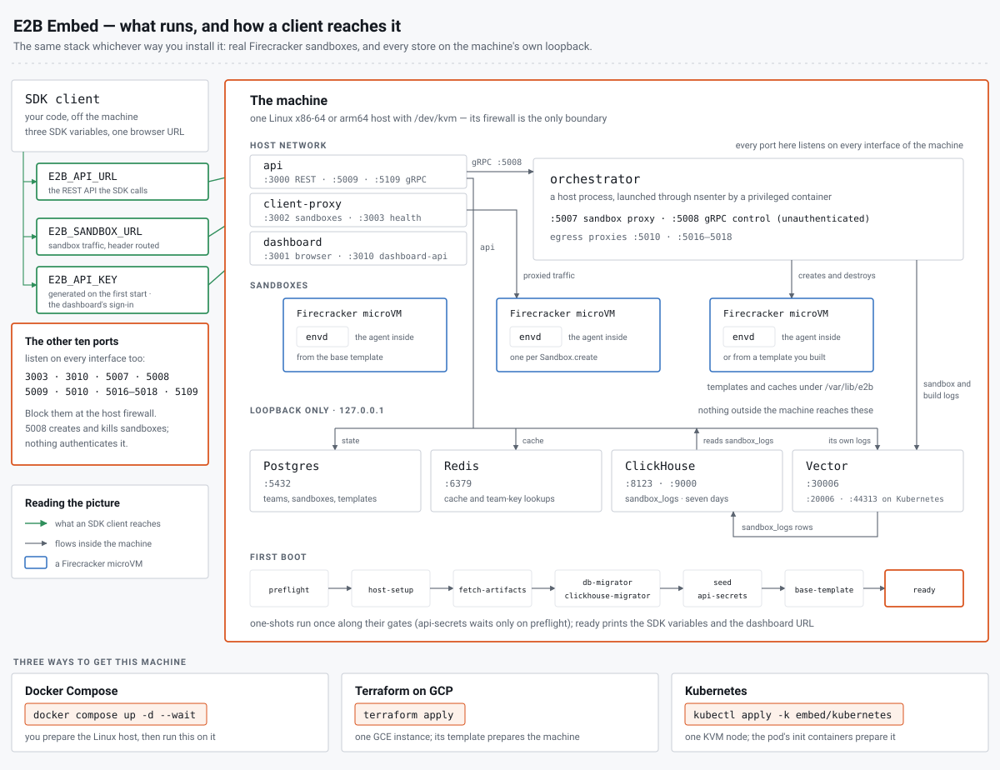

<picture>
  <source media="(prefers-color-scheme: dark)" srcset="../.github/assets/e2b-embed-dark.png">
  
</picture>

# E2B Embed

**A complete E2B, sandboxes included, on one machine you own.** Three ways to
get that machine running, all of them the same stack.

[Docker Compose](compose/README.md)
| [Terraform on GCP](terraform/gcp/README.md)
| [Kubernetes](kubernetes/README.md)
| [Reference](docs/REFERENCE.md)
| [Releasing](../docs/RELEASING.md)



## Pick a shape

| Shape | What you need | The install | Guide |
|-------|---------------|-------------|-------|
| Docker Compose | a Linux host with KVM that you may mutate | `docker compose up -d --wait` | [`compose/README.md`](compose/README.md) |
| Terraform on GCP | a GCP project and credentials | `terraform apply` | [`terraform/gcp/README.md`](terraform/gcp/README.md) |
| Kubernetes | a cluster with one KVM node | `kubectl apply -k` | [`kubernetes/README.md`](kubernetes/README.md) |

Compose and Terraform run [`compose/compose.yaml`](compose/compose.yaml) and
[`compose/.env`](compose/.env) as shipped. Kubernetes runs a StatefulSet
translated from them, with the same pins in
[`kubernetes/kustomization.yaml`](kubernetes/kustomization.yaml). All 3 are
single-machine evaluation packages, not deployment patterns. For a production
deployment see [e2b.dev/enterprise](https://e2b.dev/enterprise).

## What you get

- **Real Firecracker sandboxes on the machine.** Everything they need stays
  there: the databases, the templates you build and the logs all live on its
  disk.
- **A team API key per install.** The first start generates it and prints it
  with the 2 SDK URLs and the dashboard URL. Each guide's Secrets section says
  where its copy lives and how to rotate it.
- **Your own templates.** `Template.build` builds through the same API on any
  shape. The build runs inside a Firecracker VM on the machine; no Docker
  daemon is involved.
- **Any port inside a sandbox.** `sandbox.get_host(port)` returns an `e2b.app`
  name that does not resolve here. Reach the port through client-proxy's
  header routing instead:

  ```bash
  curl -H "E2b-Sandbox-Id: $SANDBOX_ID" -H "E2b-Sandbox-Port: 8080" http://localhost:3002/
  ```

- **A dashboard in the browser.** Port 3001 serves the open-source E2B
  dashboard: paste the team API key into its key form to see the sandboxes
  and templates the SDK sees, with a terminal and a filesystem inspector on
  each one. Those reach the sandbox through the header routing above, at
  the address in `E2B_DASHBOARD_HOST` (default `localhost`); set it when a
  browser on another machine opens the dashboard without a tunnel.
- **OpenTelemetry out.** One setting sends the E2B services' metrics, traces
  and logs to your collector. Point it at the built-in one, a second line
  away, to keep the metrics the dashboard's charts draw. The
  [reference](docs/REFERENCE.md#observability) says what each choice gives
  you.
- **One version everywhere.** Embed is released at the platform version once
  that release is tagged, and that release moves every platform pin in
  [`compose/.env`](compose/.env) and the kustomization. To pin an install, pin
  the commit: put it in place of `main` in the raw URLs, or add
  `?ref=<commit>` to the git URLs.
- **Public images, pulled anonymously.** The released E2B images, the 3 stack
  images Embed builds itself and the Firecracker binaries are all public. The
  stores come from Docker Hub.

## Ports

13 ports listen on every interface of the machine. The SDK needs 3000 and
3002; a browser needs 3001 for the dashboard. The other 10 must not be
reachable on any address the machine holds: give it no public address of its
own, or firewall those 10 ports for that address as well, not only at the
network edge.

| Port | Service | Reachable from | Purpose |
|------|---------|----------------|---------|
| 3000 | api | trusted clients | the REST API the SDK calls |
| 3001 | dashboard | trusted clients | the web dashboard, for a browser |
| 3002 | client-proxy | trusted clients | sandbox traffic (header routing) |
| 3003 | client-proxy | the machine only | health |
| 3010 | dashboard-api | the machine only | the dashboard's backend |
| 5007 | orchestrator | the machine only | sandbox proxy |
| 5008 | orchestrator | the machine only | **unauthenticated** gRPC control API |
| 5009 | api | the machine only | internal gRPC |
| 5010 | orchestrator | the machine only | sandbox egress: hyperloop proxy |
| 5016 | orchestrator | the machine only | sandbox egress: TCP firewall proxy (HTTP) |
| 5017 | orchestrator | the machine only | sandbox egress: TCP firewall proxy (TLS) |
| 5018 | orchestrator | the machine only | sandbox egress: TCP firewall proxy (other) |
| 5109 | api | the machine only | edge gRPC |

Port 5008 is the one to guard most: nothing authenticates it, and anyone who
reaches it has the whole orchestrator. The stores, Vector, the built-in
collector and the pprof endpoints stay on loopback;
[What runs where](docs/REFERENCE.md#what-runs-where) lists them.

## Not supported

- **macOS and Windows as the host.** The stack needs a Linux machine with KVM
  and a 4 KiB-page kernel, x86-64 or arm64. On Apple silicon that is a Linux
  VM with nested virtualization (M3 or newer, macOS 15 or newer). arm64 is
  verified end to end on bare metal and needs kernel 6.10 or newer; the
  Compose guide's Requirements say why.
- **Container-Optimized OS.** The machine needs apt, a writable `/etc` and
  glibc 2.34 or newer.
- **No wildcard DNS and no TLS.**

## Developing

`make` is a developer convenience; the operator path is only `docker compose`,
`terraform` or `kubectl`.

- `make images` builds the 3 stack images locally under their pinned tags.
- `make lint` renders the compose file and the kustomization, validates the
  Vector config and the Terraform module, and shellchecks the scripts and the
  tests.
- `make test` runs the bats suite in `tests/`.
- `make stores-check` runs the store-level integration check.
- `make sync-configs` re-inlines the 3 configs into the compose file.

What each target needs, and when the stack images have to be rebuilt, is in
[Developing](docs/REFERENCE.md#developing).

## Reference

[`docs/REFERENCE.md`](docs/REFERENCE.md) has the rest: what runs where and in
which order, how logs and metrics reach ClickHouse, the secrets each shape
holds, how images and pins are released, building templates, and the
developer tooling.
